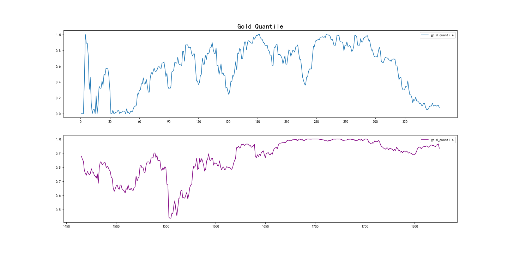
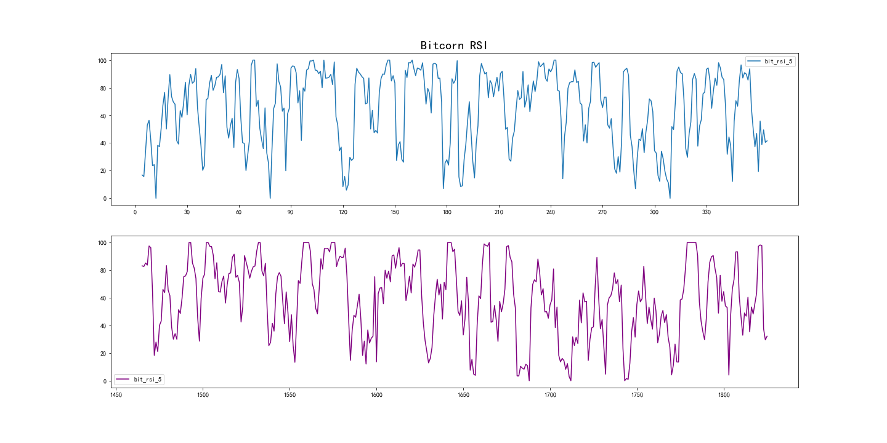
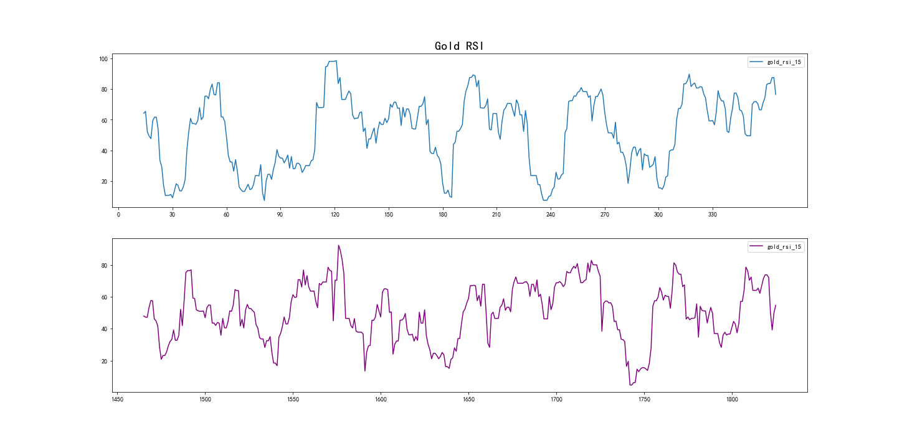

# Draft

## 摘要

黄金和比特币是两种波动性资产, 我们需要通过每天的策略进行买卖交易, 将1000美元的初始资产最大化。本文基于黄金价格的历史数据, 模拟投资情景, 在不知道未来数据的情况下, 经过数据挖掘, 基于数据特征建立投资策略模型(仓位管理模型), 为交易者后期投资明确一个方向。

对于交易员来说，只知道当天交易日和过去每个交易日的价格。要量化买卖的多少，我们需要对未来涨跌有一个初步的预测，因此我们选择时间序列模型来帮助我们衡量未来涨跌的可能性。为了多方面量化交易，我们结合目前市场上股价交易的常见指标：MA，Macd、DIF、DEA、RSI、估值分位点、乖离率，通过加权得到每天收益最高的持仓比例。由于比特币和黄金的买卖交易需要佣金，因此仓位变动时，出于成本的考虑，不能频繁进行买卖操作，所以需要给指标进行买和卖的阈值的设定。通过我们的模型，可以得出1000美元能够在五年之后得到120万的收益。

为了证明我们的模型时最佳策略，我们对权重进行微调，和单指标macd的收益对比，是远大于单指标的收益的。

为了检测对交易成本的敏感度，我们将交易成本从0.01,0.11步长0.01进行计算，可以得出5年后总资产-交易成本的关系。

关键字：量化交易、时间序列分析、特征组合，双指数移动平均线

## 模型准备

我们做出了以下假设来帮助我们建模

- 假设数据准确, 我们没有伪造数据
- 假设交易员仅知道交易日当天和过去的价格数据
- 假设两种投资产品的价值不受外界主观因素影响
- 假设16年之前没有任何历史数据
- 假设两种投资产品符合普遍投资规律，即公式系数来自经验规律

## [简介](./简介.md)

## 符号

## task1

### 数据预处理

对于给定的数据，由于有特定黄金的交易日(即工作日), 比特币每天都可交易，同时黄金的价格在休息日不会发生变化，为了方便表示，我们将量表进行合并。同时将休息日的黄金价格用过去最近的交易日价格填补。

### 指标建立

为了更好的量化交易策略，模型需要额外添加几项指标：'单日涨幅',投资风险'，历史分位点，MACD指标，RSI，MA

单日涨幅公式:(present - prev) / prev

为了让涨幅更有参考性，我们需要MA指标，即移动平均，使用用5天和15天的涨跌幅平均。

MA 采用的交易原则为：如果短期均线自下而上突破长期均线形成金叉，视为买进时机，如果长期均线从
上而下突破短期均线形成死叉，视为卖出时机，投资者可根据相应的买卖信号进
行交易。 

移动平均计算方式：

mat = sum(Pt - 1 + .... + p0) / t

历史分位点是为了显示当前估值在所有估值历史的位置，能够展示当前是高估状态还是低估状态。

估值分位点计算算法：

step 1:将当天价格和过去n天价格进行排位并去除重复项，的到排名q，

step 2: 用计算公式：quantile = (q - 1) * 100%/ (n - 1)

整体上，分位点越低， 估值越低；分位点越高，估值越高

MACD指标(平滑移动平均线)，是从双指数移动平均线变换得出；

MACD的意义和双移动平均线基本相同，即由快、慢均线的离散、聚合表征当前的多空状态和股价可能的发展变化趋势；当MACD从负数转向正数，是买的信号。当MACD从正数转向负数，是卖的信号。当MACD以大角度变化，表示快的移动平均线和慢的移动平均线的差距非常迅速的拉开，代表了一个市场大趋势的转变。

MACD 采用的交易原则为：当 DIFF 和 DEA 取值都是正的，而且 DIFF 自下向
上穿过 DEA 形成所谓的金叉时，视为买入时机，应该做多。但是有一种特殊情况
存在，由于暴跌后的小反弹容易产生低位金叉，所以低位金叉比高位金叉出现次
数频繁，如果此时盲目买入会损失惨重，因此低位金叉买入要谨慎。当 DIFF 和
DEA 取值都是负的，且 DIFF 由上而下穿过 DEA 形成所谓的死叉时，视为卖出信
时机，应当做空或平仓。 

MACD指标的计算方法：

由快的指数移动平均线(EMA(n1)),减去慢的指数移动平均线（EMA(n2)）得到快线DIF；再用DIF的9日指数平滑移动得到慢线DEA；再用2×（快线DIF-加权移动均线DEA）得到MACD柱。即MACD:(DIF-DEA)*2;

step 1:EMA初始化：通常情况下，EMA1是没有定义的，通常情况下取EMA1为Price1，即数据的第一项填充为EMA的第一项。

step 2:
EMAtoday = α * Pricetoday + (1 - α) * EMAyesterday；

step 3: DIF = EMA(n1)-EMA(n2);

step 4: DEA=（前一日DEA X a+今日DIF X a）;

step 5: MACD=（DIF-DEA）*2;

α为平滑指数，一般取作2/(N+1)。在计算本数据的MACD指标时，EMA计算中，经过我们的调查，我们选取12和26天，即 n1=12, n2=26计算出的图像如下

RSI指标
RSI ( Relative Strength Index) 通过分析市场买卖和供求
状况来预测市场走向，最早被应用于期货交易。RSI 就是计算某时期内的平均收
盘涨跌数的关系。

RSI 的交易原则为：由上式可知，RSI 的变动范围是 1 到 100。市场经验表
明，RSI > 50 则表明市场平均收盘上涨的可能性比较高，市场称为强势市场，
反之称为弱势市场。一般 RSI 在 30 到 70 之间波动。如果 RSI 值超过 80，则表
示市场买方市场严重溢出，要极强卖出。因为当 RSI 达到 80 以上时，价格极有
可能会下降。如果 RSI 低于 20 则表示市场卖方严重溢出，价格可能要回调要买
入。有的投资者把取值定为 15、85，

RSI指标的计算方法

N 日 RSI=[A÷(A+B)]×100% 
A 为 N 日内收盘涨幅之和(取正值) 
B 为 N 日内收盘跌幅之和(取正值) 

## [模型建立](模型建立.md)

## [模型建立02](模型建立02.md)

## [最佳性分析](最佳性分析.md)

## [模型评价](模型评价.md)

## [备忘录](备忘录.md)