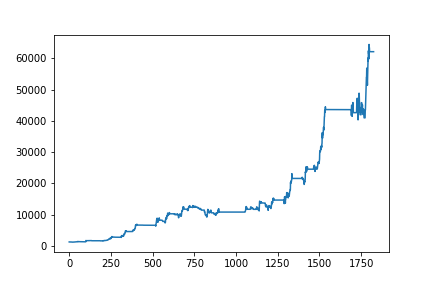
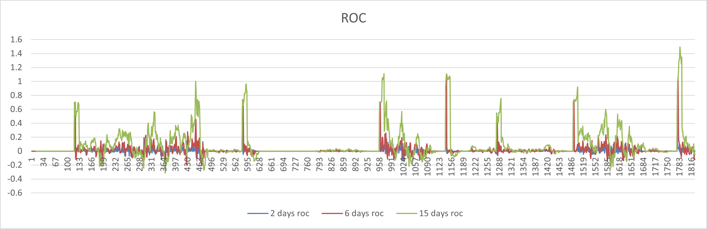
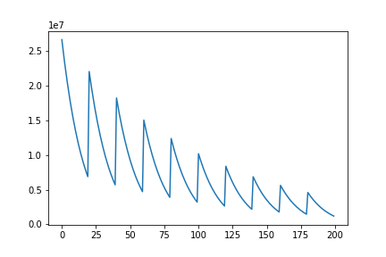

# 最佳性分析

为了证明我们模型的最佳新，我们使用了目前普遍指标macd进行单指标策略买卖，得到的总资产结果如下：

可以看出总资产是远远落后于我们的模型

macd模型最后收益近似60000，涨幅59%

我们的模型1000美元最后的收益是24992548.649美元，涨幅：24991%，比macd模型多了整整24932个点

同时，最佳的模型少不了收益的稳定性，我们的模型在震荡市场下也具有稳定性，通过测试2日、5日、15日的变动幅度指标

可以看到，变动率基本在x轴以上，说明总计产较为稳定呈现上升趋势，下跌次数和下跌量少。

# 交易成本的敏感程度

我们对将0.01-0.11不同的成本带入模型进行分析，再计算总资产，得到结果如下：

从图中可以看出，随交易成本的上升，震荡幅度十分明显，说明总资产对交易成本是及其敏感的。同时收益在逐渐减少。因此交易员需要重新用涨幅评价模型进行指标权重的更新。

