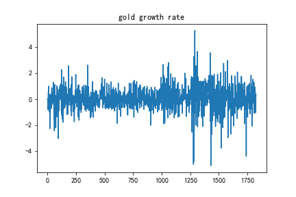
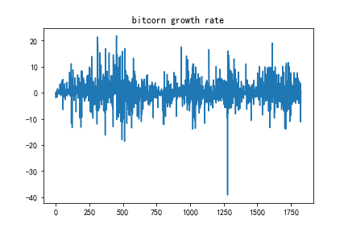
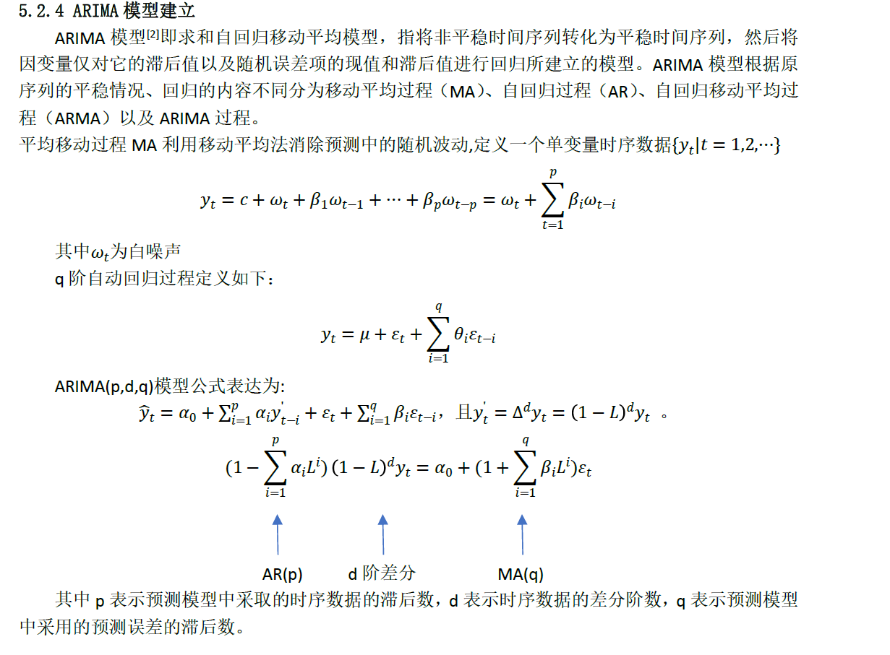
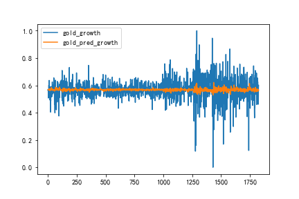
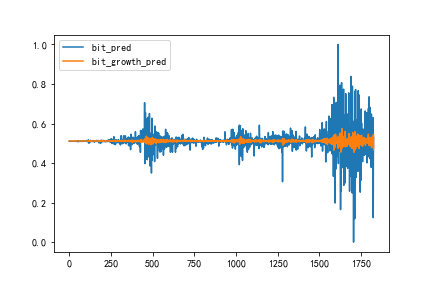
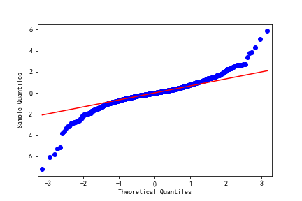
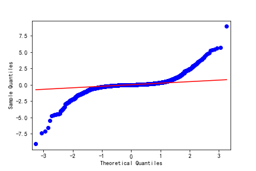

# 模型建立

为了获得未来涨跌的可能性，我们需要在已有的价格上对未来进行预测。通过计算涨幅率，我们粗略的估计涨幅是满足时间序列的。因此我们对涨幅进行时间序列（ARIMA）的分析。

**来源论文：基于ARIMA模型的金价时序分析**

我们通过软件SPSS的穷举法，我们得到最优时间序列的三个参数p，d阶差分，q，得到的结果如下：

|        | p | q | r  |
|--------|:-:|:-:|:--:|
| 黄金   | 2 | 0 | 6  |
| 比特币 | 2 | 0 | 10 |

得到的预测涨幅如图：

模型检验：

1. qq图检验

我们使用模型的残差qq图来检验arima是否学到了相应的特征，如果残差是白噪声序列，说明时间序列中有用的信息已经被提取完毕了，剩下的全是随机扰动，是无法预测和使用的。
在此qq图中，如果是正态分布，那么是一条直线（红线），显然结果大致符合白噪声

2. DW检验

使用Durbin-Watson 检验，又称 DW 检验，是用来检验回归分析中残差的一阶自相关性的(尤其针对时间序列数据)。该统计量值越接近 2 越好，一般在 1~3 之间说明没问题，小于 1 这说明残差存在自相关性。

我们对结果进行检验，得到数据如下:

|        | Score  |
|--------|--------|
| 黄金   | 2.0382 |
| 比特币 | 2.0348 |

