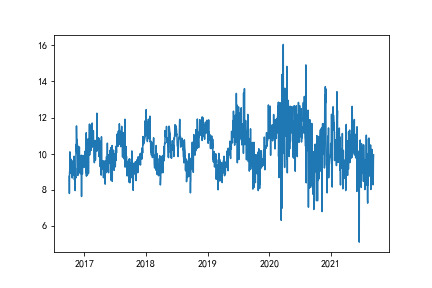
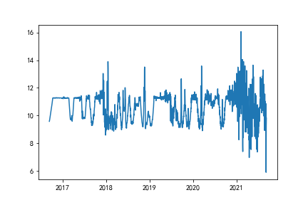

# 涨幅评分模型

我们现在得到了预计的涨幅。另macd，ma，rsi，5日/15日均线乖离率分别为x1, x2, x3, x4。由于黄金属于长线交易，比特币属于短线交易，因此我们将黄金每15天进行一次权重更新，比特币每5天进行权重更新。这样可以避免平凡买卖的问题。
加权算法（第一天需要初始化w）：

sigmoid = 

为了使n日内的收益最大，需要模拟一个动态规划的模型，我们用了一个反向传播的思想来更新权重使收益最大。我们对评分进行了一个分段判断，30%一下进行一个卖出，70%以上进行买入。这样可以防止买卖过于平凡且模拟了交易员估算的过程。由于当日的买入评分和过去5天/15天的买卖评分相关，因此接近于一个非独立马尔科夫链，符合时间规律。

单日收益：

price(t+1)为预测的价格

n日内的收益最大值：

接下来最大值需要我们对w进行更新，使用反向传播和梯度下降的方法：

求解之后带入明天的的W，作为明天w的初始化值。

## 求解结果

最终买卖评分：

## 合理性分析：

当价格处于低点时，应当买入，评分变高；当价格处于高点时，应当卖出，评分变低

## 模型结果：

将求解出来的结果带入每日收益计算公式：。。。

得出的总收益结果为：

现金持有份额：

比特币持有份额

黄金持有份额

